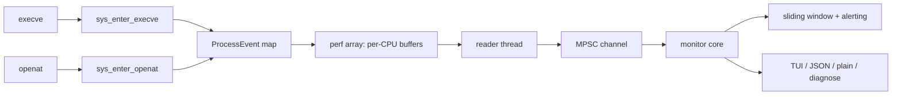
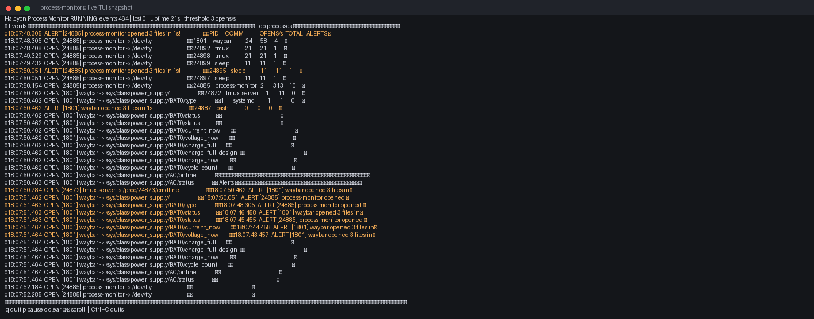

<div align="center">

[](https://crates.io/crates/process-monitor)
[](https://github.com/BartoszOsiej/halcyon-process-monitor/pkgs/container/halcyon-process-monitor)
[](https://github.com/BartoszOsiej/halcyon-process-monitor/releases)
[](LICENSE)

**Real-time, eBPF-based process and file-operation telemetry for Linux.**

</div>

Halcyon traces `execve` and `openat` syscalls at the kernel level using eBPF
tracepoints, streams events into userspace through per-CPU perf buffers, and
surfaces them in a live terminal TUI — while continuously scoring per-process
file-open rates against a sliding window to flag ransomware-style mass file access.

> [!IMPORTANT]
> **Verified live**: eBPF loaded, events flowing through per-CPU perf buffers,
> TCP alert fired when a process exceeded the 1-second window threshold.

## Architecture



## Screenshot



## Features

| Capability | Description |
|---|---|
| **Kernel-level tracing** | `execve` and `openat` tracepoints attached on every online CPU |
| **Verifier-safe kernel code** | Userspace pointers read exclusively via `bpf_probe_read_user` — never dereferenced |
| **Zero-copy event pipeline** | Fixed-size `ProcessEvent` records streamed through per-CPU `PerfEventArray` buffers |
| **Live TUI** | Event log, per-process stats table, and alert panel rendered with `ratatui` |
| **Sliding-window heuristic** | 1-second rolling window per PID; alerts when a process exceeds the configured open rate |
| **Multiple output modes** | Human TUI, newline-delimited JSON, plain text log, built-in self-diagnostic |
| **Lost-event accounting** | Perf-buffer overruns are counted and reported, never silently dropped |
| **Single static binary** | Full LTO, `panic = "abort"`, symbol-stripped release profile |

<details>
<summary><b>⚙️ Requirements</b></summary>

| Requirement | Notes |
|---|---|
| Linux kernel **5.8+** | eBPF + tracepoint support |
| **root** (`CAP_BPF` / `CAP_SYS_ADMIN`) | Required to load and attach eBPF programs |
| Rust **nightly** + `rust-src` | Builds the eBPF program with `-Z build-std` |
| `bpf-linker`, `clang`, C compiler | eBPF linking toolchain |
| BTF (`/sys/kernel/btf/vmlinux`) | Recommended for CO-RE compatibility |

The userspace binary builds on stable Rust; only the eBPF crate needs nightly.

</details>

## Quick Start

The fastest path is the distro-aware installer — it detects your package
manager (apt, dnf, pacman, zypper, apk, xbps), installs build dependencies,
provisions the Rust toolchain, builds, and installs:

```bash
# System-wide install to /usr/local (prompts before every change):
./install.sh --system

# User-local install to ~/.local (no sudo needed):
./install.sh

# Or build manually:
./build.sh && sudo target/release/process-monitor
```

## Usage

```bash
sudo process-monitor                          # TUI (default when stdout is a terminal)
sudo process-monitor --alert-threshold 100    # raise the alert threshold
sudo process-monitor --json | jq .            # machine-readable output
sudo process-monitor --plain                  # plain text log
sudo process-monitor --diagnose               # 5-second end-to-end self-diagnostic
```

<details>
<summary><b>⌨️ TUI keys & CLI reference</b></summary>

| Key | Action |
|---|---|
| `q`, `Esc`, `Ctrl+C` | Quit |
| `p` | Pause / resume the event stream |
| `c` | Clear the event log |
| `↑` / `↓`, `j` / `k` | Scroll the event log |
| `PgUp` / `PgDn` | Scroll faster |

| Flag | Default | Description |
|---|---|---|
| `-b, --bpf <PATH>` | auto-discovered | Path to the compiled eBPF object |
| `--alert-threshold <N>` | `50` | Alert at N+ opens within 1 s (`0` disables) |
| `--json` | off | Newline-delimited JSON output |
| `--plain` | off | Plain text log output |
| `--tui` | off | Force the TUI even without a terminal |
| `--diagnose` | off | Run self-diagnostic and exit |

</details>

<details>
<summary><b>📄 JSON output schema</b></summary>

```jsonc
// Process event
{"ts": "14:09:16.531", "type": "open", "pid": 29645, "uid": 1000, "comm": "process-monitor", "file": "/dev/tty"}
{"ts": "14:09:16.532", "type": "exec", "pid": 29645, "uid": 1000, "comm": "bash", "file": "/usr/bin/ls"}

// Alert
{"ts": "14:09:16.973", "type": "alert", "pid": 2126, "uid": 1000, "comm": "Cache2 I/O", "opens_in_1s": 50}
```

| Field | Present in | Meaning |
|---|---|---|
| `ts` | all | Local timestamp, `HH:MM:SS.mmm` |
| `type` | all | `exec`, `open`, or `alert` |
| `pid` / `uid` | all | Process ID / user ID that triggered the syscall |
| `comm` | all | Process name (16-byte `comm`, truncated) |
| `file` | exec/open | Target path (64-byte buffer, truncated) |
| `opens_in_1s` | alert | File opens counted in the current sliding window |

</details>

<details>
<summary><b>🔧 How it works & project structure</b></summary>

1. Two kernel tracepoints (`sys_enter_execve`, `sys_enter_openat`) capture PID,
   UID, `comm`, and target filename into a compact fixed-layout `ProcessEvent`
   pushed into the `EVENTS` `PerfEventArray`.
2. A dedicated reader thread opens one perf buffer per online CPU and forwards
   decoded events over an MPSC channel to the monitor core.
3. The monitor keeps a 1-second sliding window of file opens per PID and raises
   an alert when a process crosses the threshold.
4. Output renders according to mode: TUI, JSON, plain, or diagnostic report.

Full design: **[ARCHITECTURE.md](ARCHITECTURE.md)**

```
halcyon-process-monitor/
├── process-monitor/          # Userspace: monitor core + TUI + output modes
│   └── src/
│       ├── main.rs           # CLI, mode selection, signal handling
│       ├── monitor.rs        # eBPF loading, perf reader, sliding-window tracker
│       └── tui.rs            # ratatui interface (events / stats / alerts)
├── process-monitor-ebpf/     # Kernel side (#![no_std], aya-ebpf)
│   └── src/main.rs           # tracepoint hooks → PerfEventArray
├── build.sh                  # Build script (nightly for eBPF, stable for TUI)
└── install.sh                # Distro-aware installer / uninstaller
```

</details>

> [!NOTE]
> The installer never reads or logs tokens, credentials, or environment secrets,
> and makes **no authenticated network requests**. Dependencies come only from
> official distro repositories.

## Troubleshooting

Run the built-in self-diagnostic to verify toolchain, tracepoint availability,
eBPF loading, and event flow end to end:

```bash
sudo process-monitor --diagnose
```

- **No events at all** → confirm tracepoints exist and perf buffers opened
- **`failed to load eBPF program`** → pass `--bpf` explicitly or re-run `./install.sh`
- **Not running as root** → `Monitor::start` bails with a clear `CAP_BPF` message

---

<div align="center">

**Part of [BartoszOsiej](https://github.com/BartoszOsiej)'s systems toolkit** · [`externum`](https://github.com/BartoszOsiej/externum) · [`cybersec-tools`](https://github.com/BartoszOsiej/cybersec-tools) · [`NV2_ENGINE`](https://github.com/BartoszOsiej/NV2_ENGINE)

MIT © 2026 Bartosz Osiej

</div>
